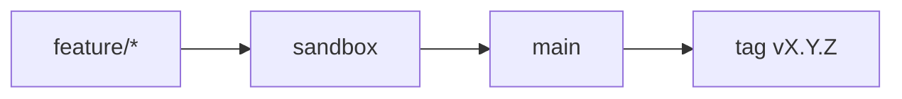

# Contributing

Thanks for considering a contribution to the **AI Operating System**.

## Git flow (required)

[`docs/guides/git-workflow.md`](./docs/guides/git-workflow.md) · [`docs/guides/task-kickoff.md`](./docs/guides/task-kickoff.md)



**Never** commit directly to `main` or `sandbox`.

## Git hooks (required)

```bash
git config core.hooksPath .githooks
```

- `commit-msg` — Conventional Commits + Gitmoji; strips IDE trailers
- `pre-push` — blocks push to `main` with SemVer drift (issue #15)

CI re-validates messages and SemVer alignment (do not use `--no-verify`).

## How to contribute

1. Issue → In Progress on the Project
2. Branch from `sandbox`
3. Enable hooks (`core.hooksPath`)
4. Commits: Conventional Commits + Gitmoji
5. Author: `Kleilson Santos <kdsddesign1@gmail.com>` — no IDE co-authorship
6. PR → `sandbox`, then `sandbox` → `main`
7. Releaseable delivery on `main` requires SemVer bump + CHANGELOG + tag ([releases.md](./docs/guides/releases.md))
8. Include docs in the same PR if build/usage/architecture changes

## Branch prefixes

`feature/` · `fix/` · `docs/` · `chore/` · `ci/` · `refactor/` · `test/` · `build/` · `perf/`

## Code of conduct

[CODE_OF_CONDUCT.md](./CODE_OF_CONDUCT.md)
