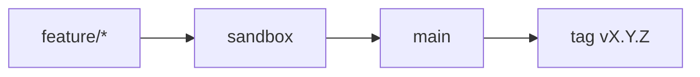

# Contributing

Obrigado por considerar contribuir com o **AI Operating System**.

## Fluxo Git (obrigatório)

[`docs/guides/git-workflow.md`](./docs/guides/git-workflow.md) · [`docs/guides/task-kickoff.md`](./docs/guides/task-kickoff.md)



**Nunca** commit direto em `main` ou `sandbox`.

## Hooks Git (obrigatório)

```bash
git config core.hooksPath .githooks
```

- `commit-msg` — Conventional Commits + Gitmoji; remove trailers de IDE
- `pre-push` — bloqueia push para `main` com drift SemVer (issue #15)

CI revalida mensagens e alinhamento SemVer (não use `--no-verify`).

## Como contribuir

1. Issue → In Progress no Project
2. Branch a partir de `sandbox`
3. Ativar hooks (`core.hooksPath`)
4. Commits: Conventional Commits + Gitmoji
5. Autoria: `Kleilson Santos <kdsddesign1@gmail.com>` — sem co-autoria de IDE
6. PR → `sandbox` → depois `sandbox` → `main`
7. Entrega releaseable em `main` exige bump SemVer + CHANGELOG + tag ([releases.md](./docs/guides/releases.md))
8. Docs no mesmo PR se mudar build/uso/arquitetura

## Prefixos de branch

`feature/` · `fix/` · `docs/` · `chore/` · `ci/` · `refactor/` · `test/` · `build/` · `perf/`

## Código de conduta

[CODE_OF_CONDUCT.md](./CODE_OF_CONDUCT.md)
