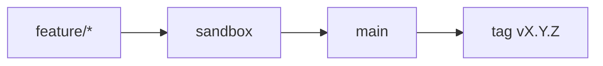

# Contributing

Thanks for considering a contribution to the **AI Operating System**.

## Git flow (required)

[`docs/guides/git-workflow.md`](./docs/guides/git-workflow.md) · [`docs/guides/task-kickoff.md`](./docs/guides/task-kickoff.md)



**Never** commit directly to `main` or `sandbox`.

## Git hooks (required)

```bash
git config core.hooksPath .githooks
```

- `commit-msg`: Conventional Commits + Gitmoji; strips IDE trailers
- `pre-commit`: Runs lint-staged (lint + format), typecheck, and tests on staged files
- `pre-push`: Runs dependency audit and blocks direct push to `main` and `sandbox`

CI re-validates messages and SemVer alignment (do not use `--no-verify`).

## Quality Gates

To merge code into `main` or `sandbox`, all the following gates must pass:

### Local Checks (pre-commit/pre-push)

- ✅ Linting (ESLint)
- ✅ Formatting (Prettier)
- ✅ TypeScript typecheck
- ✅ Tests (vitest)
- ✅ Dependency audit (pnpm audit)

### CI Checks (GitHub Actions)

- ✅ Commitlint (conventional commits + gitmoji)
- ✅ Typecheck
- ✅ Lint & Format checks
- ✅ Tests (with coverage)
- ✅ Build
- ✅ Security audit
- ✅ CodeQL (security analysis)
- ✅ SonarQube Cloud (quality analysis)
- ✅ SonarQube Quality Gate (merge blocker)
- ✅ Codecov (test coverage reporting)
- ✅ SemVer alignment (for merges to main)

### GitHub Branch Protection Rules (main + sandbox)

- 🚫 No direct pushes allowed
- ✅ At least 1 reviewer approval required
- ✅ All CI checks must pass
- ✅ Commits must be signed (GPG/SSH)

## Tools Used

| Tool            | Purpose                                       |
| --------------- | --------------------------------------------- |
| ESLint          | Static code analysis and linting              |
| Prettier        | Code formatting                               |
| lint-staged     | Run checks on staged files only               |
| CodeQL          | Security vulnerability scanning               |
| SonarQube Cloud | Code quality and technical debt analysis      |
| Codecov         | Test coverage monitoring                      |
| Dependabot      | Automatic dependency updates (security fixes) |

## How to contribute

1. Issue → In Progress on the Project
2. Branch from `sandbox`
3. Enable hooks (`git config core.hooksPath .githooks`)
4. Commits: Conventional Commits + Gitmoji
5. Author: `Kleilson Santos <kdsddesign1@gmail.com>` — no IDE co-authorship
6. PR → `sandbox`, then `sandbox` → `main`
7. Releaseable delivery on `main` requires SemVer bump + CHANGELOG + tag ([releases.md](./docs/guides/releases.md))
8. Include docs in the same PR if build/usage/architecture changes

## Branch prefixes

`feature/` · `fix/` · `docs/` · `chore/` · `ci/` · `refactor/` · `test/` · `build/` · `perf/`

## Code of conduct

[CODE_OF_CONDUCT.md](./CODE_OF_CONDUCT.md)
