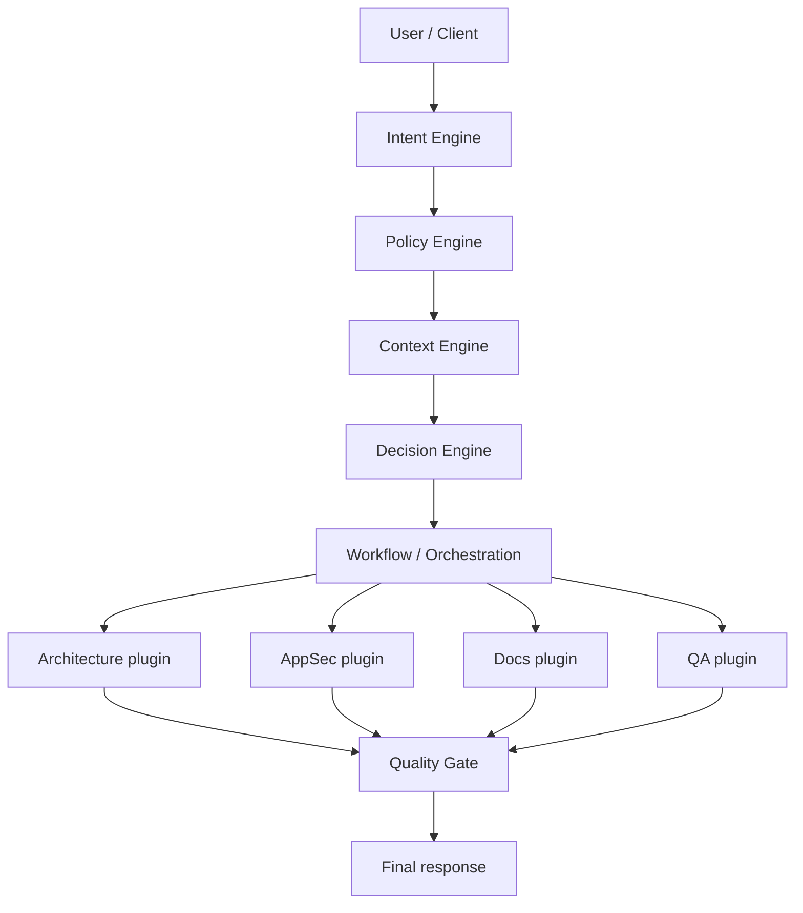

# System Guide — AIOS (Phase 1)

Operational guide for the core implemented first. The full map is in [overview.md](./overview.md).

## End-to-end flow (Phase 1)

## Contracts (sketch)

| Port       | Who talks           | What                                                                            |
| ---------- | ------------------- | ------------------------------------------------------------------------------- |
| CLI / API  | Human or integrator | `PipelineRequest` → `runPipeline` → `PipelineResponse` (`contractVersion: "1"`) |
| Engine API | Internal            | Typed events between engines                                                    |
| Plugin API | Agents              | Context + policies input → artifact                                             |

### Intent Engine (`@aios/intent`) — issue #5

`resolveIntent(raw)` → `{ raw, kind, confidence, signals }`.

Phase 1 kinds: `analyze.project` · `explain.code` · `review.change` · `unknown`.

Heuristic classification (no LLM). Details: [`engines/intent/README.md`](../../engines/intent/README.md).

### Policy Engine (`@aios/policy`) — issue #6

`loadPolicies()` → `{ rules, source, path? }` · `applyPolicies(rules)` → `{ constraints, mustIds }`.

Optional file: `policies/aios.policies.json` (or `AIOS_POLICIES_PATH` / `configPath`).

Phase 1 injection: `runWorkflow(intent, { policies })` appends `policy:<id>` and `policies.injected` to plugin results.

Details: [`engines/policy/README.md`](../../engines/policy/README.md).

### Context Engine (`@aios/context`) — issue #7

`gatherContext({ repoPath, scope? })` → `{ repoPath, scope, snippets[], signals[] }`.

Typed snippets: `doc` · `code` · `manifest` (truncated content). Scope is a path relative to the repo root.

Injection: `runWorkflow(intent, { context })` appends `context:<path>` and `context.injected:N`.

Details: [`engines/context/README.md`](../../engines/context/README.md).

### Cursor Chat bridge (Level 1)

`pnpm sync:cursor-rules` → `.cursor/rules/aios-*.mdc` (`alwaysApply`) from `policies/aios.policies.json`.

Short request in chat; policies injected without the CLI. Guide: [`docs/guides/cursor-chat-bridge.md`](../guides/cursor-chat-bridge.md).

### Decision · Orchestration · Quality Gate — issue #8

- `shouldRunAgent` / `agentsForIntent` — matrix by `IntentKind` (unknown = none).
- `runWorkflow` → `{ results, ran, skipped }` with policies + context injection.
- Plugins (architecture / appsec / docs / qa): heuristic findings over the bundle.
- `evaluateQuality(results, { intent, context })` blocks an inconsistent package; CLI exit `1` on failure.

### CLI/API contract (`@aios/pipeline`) — issue #9

`runPipeline({ input, repoPath?, workspaceId?, scope?, policiesPath? })` → `PipelineResponse` with `contractVersion: "1"`.

CLI (`@aios/cli`) is a thin client of this contract (`--workspace`). Integrators depend on `@aios/pipeline` + `@aios/shared` — [ADR-0003](../adr/0003-pipeline-integration-contract.md).

### Multi-repo (`@aios/workspace`) — issue #43 / #55

Registry `workspaces/aios.workspaces.json` · resolve by `workspaceId` · upsert/validate · `runAcrossWorkspaces` · [ADR-0004](../adr/0004-multi-repo-workspace-registry.md) · [ADR-0007](../adr/0007-multi-repo-generic-ops.md).

### Knowledge Graph (`@aios/knowledge`) — issue #47

Heuristic `buildKnowledgeGraph` · summary in `PipelineResponse.knowledge` · MCP `aios_build_knowledge` · [ADR-0005](../adr/0005-knowledge-graph-heuristic.md).

### Memory (`@aios/memory`) — issue #51

Local store `.aios/memory/{workspaceId}.json` · `remember`/`recall` · MCP `aios_memory_*` · [ADR-0006](../adr/0006-memory-engine-session.md).

### Prompt Engine (`@aios/prompt`) — issue #59

`compilePrompt` → markdown brief (policies + memory + KG) · MCP `aios_compile_prompt` · CLI `--compile-prompt` · [ADR-0008](../adr/0008-prompt-engine-brief.md).

### Multi-provider (`@aios/provider`) — issue #67

`AIProvider` + Ollama + OpenAI-compatible + Anthropic · MCP `aios_provider_*` · chat usage → `.aios/metrics/events.jsonl` (`chatWithMetrics`, ADR-0019) · Prometheus text scrape (`GET /metrics` / `--metrics-prometheus`, ADR-0021) · [ADR-0009](../adr/0009-multi-provider-ollama.md) · [ADR-0016](../adr/0016-openai-compatible-provider.md) · [ADR-0017](../adr/0017-anthropic-provider.md). Does not replace the IDE LLM.

### Governance console (`@aios/console` / `@aios/status`) — issue #71

Health + Needs attention + **Try it** (safe actions) · API `/api/status` · `POST /api/action` · [ADR-0010](../adr/0010-governance-console.md) · [ADR-0012](../adr/0012-console-safe-actions.md). Inactive optional provider = warn ([ADR-0011](../adr/0011-resource-aware-macos.md)).

### Resource-Aware (macOS) — ADR-0011

Inspect before install · reuse · minimize hardware · [policy](../policies/resource-aware-macos.md).

### Documentation + Governance (#80)

`auditDocumentation` · `auditGovernance` / `recordDecision` (v2 signals) · MCP `aios_audit_docs` / `aios_governance_*` · [ADR-0013](../adr/0013-documentation-governance-engines.md) · [ADR-0020](../adr/0020-governance-audit-v2.md).

### Control plane · Companion — ADR-0014

AIOS governs; Companion (voice/UX/environment) consumes via MCP/pipeline — [guide](../guides/control-plane-companion.md). Repo: [`aios-companion`](https://github.com/KleilsonSantos/aios-companion) (#90). Do not duplicate engines.

### Operational State (#84)

`getOperationalState` · MCP `aios_operational_state` · CLI `--operational-state` · [ADR-0015](../adr/0015-operational-state.md). On-demand; no voice/IDE.

## What Phase 1 does NOT include

- Full UI (Grafana / multi-tenant SaaS)
- Cloud providers (Claude/OpenAI/Gemini) — Ollama stub only (#67)
- Full Knowledge Graph (embeddings / store)
- Distributed multi-machine memory

Those land in Phases 2–3 ([ROADMAP](../ROADMAP.md)).
