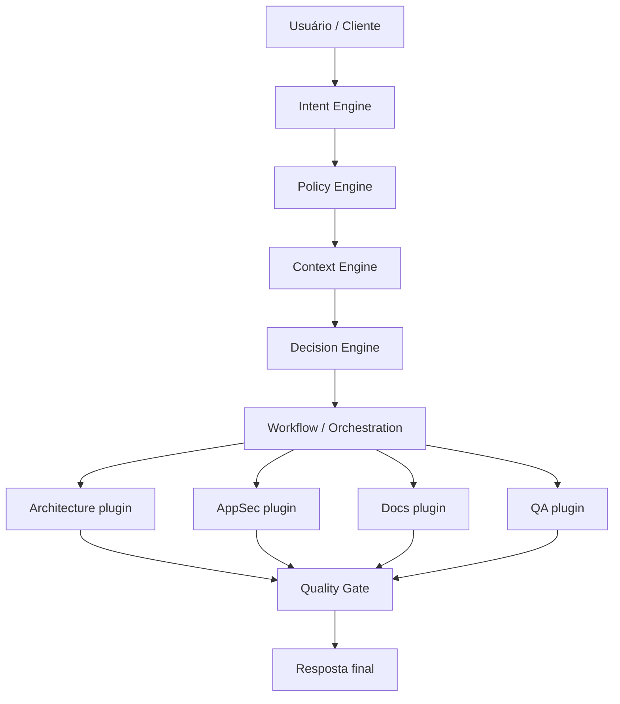

# System Guide — AIOS (Fase 1)

Guia operacional do núcleo que será implementado primeiro. O mapa completo está em [overview.md](./overview.md).

## Fluxo ponta a ponta (Fase 1)

## Contratos (esboço)

| Porta | Quem fala | O quê |
| --- | --- | --- |
| CLI / API | Humano ou integrador | `PipelineRequest` → `runPipeline` → `PipelineResponse` (`contractVersion: "1"`) |
| Engine API | Interno | Eventos tipados entre engines |
| Plugin API | Agentes | Input de contexto + policies → artefato |

### Intent Engine (`@aios/intent`) — issue #5

`resolveIntent(raw)` → `{ raw, kind, confidence, signals }`.

Kinds Fase 1: `analyze.project` · `explain.code` · `review.change` · `unknown`.

Classificação heurística (sem LLM). Detalhe: [`engines/intent/README.md`](../../engines/intent/README.md).

### Policy Engine (`@aios/policy`) — issue #6

`loadPolicies()` → `{ rules, source, path? }` · `applyPolicies(rules)` → `{ constraints, mustIds }`.

Arquivo opcional: `policies/aios.policies.json` (ou `AIOS_POLICIES_PATH` / `configPath`).

Injeção Fase 1: `runWorkflow(intent, { policies })` anexa `policy:<id>` e `policies.injected` nos resultados dos plugins.

Detalhe: [`engines/policy/README.md`](../../engines/policy/README.md).

### Context Engine (`@aios/context`) — issue #7

`gatherContext({ repoPath, scope? })` → `{ repoPath, scope, snippets[], signals[] }`.

Snippets tipados: `doc` · `code` · `manifest` (conteúdo truncado). Escopo por path relativo à raiz do repo.

Injeção: `runWorkflow(intent, { context })` anexa `context:<path>` e `context.injected:N`.

Detalhe: [`engines/context/README.md`](../../engines/context/README.md).

### Ponte Cursor Chat (Nível 1)

`pnpm sync:cursor-rules` → `.cursor/rules/aios-*.mdc` (`alwaysApply`) a partir de `policies/aios.policies.json`.

Pedido curto no chat; policies injetadas sem CLI. Guia: [`docs/guides/cursor-chat-bridge.md`](../guides/cursor-chat-bridge.md).

### Decision · Orchestration · Quality Gate — issue #8

- `shouldRunAgent` / `agentsForIntent` — matriz por `IntentKind` (unknown = nenhum).
- `runWorkflow` → `{ results, ran, skipped }` com injeção de policies + context.
- Plugins (architecture / appsec / docs / qa): findings heurísticos sobre o bundle.
- `evaluateQuality(results, { intent, context })` bloqueia pacote inconsistente; CLI exit `1` se falhar.

### Contrato CLI/API (`@aios/pipeline`) — issue #9

`runPipeline({ input, repoPath?, workspaceId?, scope?, policiesPath? })` → `PipelineResponse` com `contractVersion: "1"`.

CLI (`@aios/cli`) é cliente fino desse contrato (`--workspace`). Integradores dependem de `@aios/pipeline` + `@aios/shared` — [ADR-0003](../adr/0003-pipeline-integration-contract.md).

### Multi-repo (`@aios/workspace`) — issue #43 / #55

Registry `workspaces/aios.workspaces.json` · resolve por `workspaceId` · upsert/validate · `runAcrossWorkspaces` · [ADR-0004](../adr/0004-multi-repo-workspace-registry.md) · [ADR-0007](../adr/0007-multi-repo-generic-ops.md).

### Knowledge Graph (`@aios/knowledge`) — issue #47

`buildKnowledgeGraph` heurístico · resumo em `PipelineResponse.knowledge` · MCP `aios_build_knowledge` · [ADR-0005](../adr/0005-knowledge-graph-heuristic.md).

### Memory (`@aios/memory`) — issue #51

Store local `.aios/memory/{workspaceId}.json` · `remember`/`recall` · MCP `aios_memory_*` · [ADR-0006](../adr/0006-memory-engine-session.md).

### Prompt Engine (`@aios/prompt`) — issue #59

`compilePrompt` → brief markdown (policies + memory + KG) · MCP `aios_compile_prompt` · CLI `--compile-prompt` · [ADR-0008](../adr/0008-prompt-engine-brief.md).

### Multi-provider (`@aios/provider`) — issue #67

`AIProvider` + `OllamaProvider` (aux local) · MCP `aios_provider_health` / `aios_provider_models` / `aios_provider_chat` · CLI `--provider-health` · [ADR-0009](../adr/0009-multi-provider-ollama.md). Não substitui o LLM da IDE.

### Console de governança (`@aios/console` / `@aios/status`) — issue #71

Health + Needs attention + **Try it** (safe actions) · API `/api/status` · `POST /api/action` · [ADR-0010](../adr/0010-governance-console.md) · [ADR-0012](../adr/0012-console-safe-actions.md). Provider auxiliar inativo = warn ([ADR-0011](../adr/0011-resource-aware-macos.md)).

### Resource-Aware (macOS) — ADR-0011

Inspecionar antes de instalar · reutilizar · minimizar hardware · [política](../policies/resource-aware-macos.md).

### Documentation + Governance (#80)

`auditDocumentation` · `auditGovernance` / `recordDecision` · MCP `aios_audit_docs` / `aios_governance_*` · [ADR-0013](../adr/0013-documentation-governance-engines.md).

## O que Fase 1 NÃO inclui

- UI completa (Grafana / multi-tenant SaaS)
- Providers cloud (Claude/OpenAI/Gemini) — stub Ollama só (#67)
- Knowledge Graph completo (embeddings / store)
- Memory distribuída multi-máquina

Esses itens entram nas Fases 2–3 ([ROADMAP](../ROADMAP.md)).
