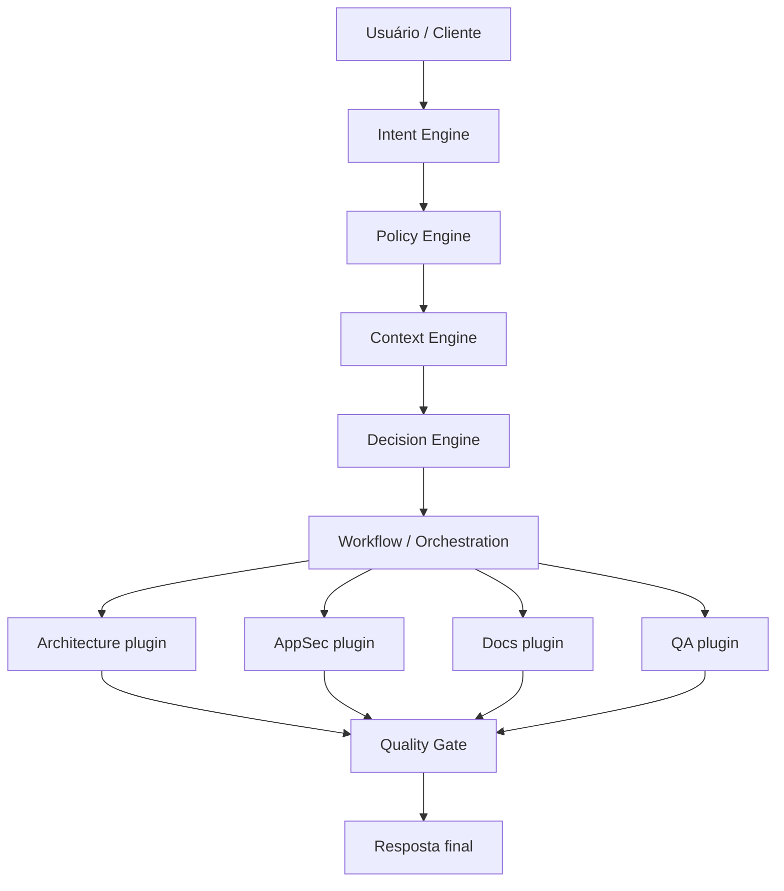

# System Guide — AIOS (Fase 1)

Guia operacional do núcleo que será implementado primeiro. O mapa completo está em [overview.md](./overview.md).

## Fluxo ponta a ponta (Fase 1)

## Contratos (esboço)

| Porta | Quem fala | O quê |
| --- | --- | --- |
| CLI / API | Portfólio ou humano | Intent + escopo (path do repo) |
| Engine API | Interno | Eventos tipados entre engines |
| Plugin API | Agentes | Input de contexto + policies → artefato |

Detalhamento de schemas chega com o scaffold de código (próximo marco).

## O que Fase 1 NÃO inclui

- UI completa
- Multi-provider LLM genérico
- Knowledge Graph completo
- Memory persistente multi-projeto

Esses itens entram nas Fases 2–3 ([ROADMAP](../ROADMAP.md)).
