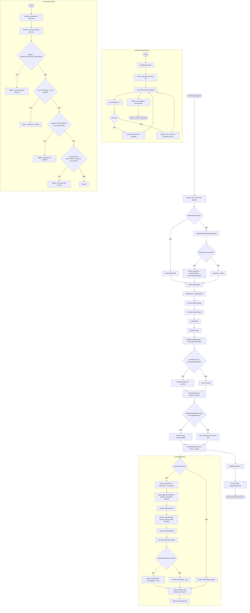

# Product & Purpose Integral Validation — Diagrams

| Field             | Value                                                                                                                                                                                                                 |
| ----------------- | --------------------------------------------------------------------------------------------------------------------------------------------------------------------------------------------------------------------- |
| **Date**          | 2026-08-31                                                                                                                                                                                                            |
| **Companion doc** | [`product-purpose-integral-validation-audit-2026-08.md`](./product-purpose-integral-validation-audit-2026-08.md)                                                                                                      |
| **Language note** | Diagram labels are **pt-BR** by explicit owner request (chat, 2026-08-31). This is a deliberate exception scoped to these two diagrams only — ADR-0018 / `docs-language-en` still governs regular product-docs prose. |

Two diagrams generated during the product/purpose audit session:

1. **Fluxograma** — real execution flow of `runPipeline` (`packages/pipeline/src/index.ts`), the quality gate (`engines/quality-gate/src/index.ts`), multi-workspace fan-out (`runAcrossWorkspaces`), and the MCP capability gate (`authorizeMcpTool`, `packages/shared/src/index.ts`).
2. **Diagrama de classes** — conceptual/data model implied by the audit prompt itself ([`product-purpose-integral-validation.v1.md`](../prompts/by-domain/ai-engineering/product-purpose-integral-validation.v1.md)), not object-oriented source code.

Both diagrams were validated with the Mermaid syntax validator before being saved here.

---

## 1. Fluxograma — `runPipeline` / quality gate / multi-workspace / MCP

## 2. Diagrama de classes — modelo conceitual do prompt de auditoria

```mermaid
classDiagram
    class DefinicaoDoPrompt {
        +String id
        +String titulo
        +String dominio
        +String proposito
        +String[] tags
        +int versao
        +String status
        +String idioma
        +boolean prontoParaIA
        +String[] docsRelacionados
        +String[] promptsRelacionados
        +Date criadoEm
        +Date atualizadoEm
    }

    class ConfiguracaoDeVinculo {
        +String repoRemoto
        +String workspaceLocal
        +String branchDeReferencia
        +String commitSha
        +String caminhoEvidencias
        +boolean cloneNaoPermitido
        +String referenciaPolicies
        +getCaminhoEvidencias() String
    }

    class RegraDeDeduplicacao {
        +String promptExistente
        +String condicaoDeUso
        +String condicaoParaEvitar
    }

    class MatrizAderenciaProposito {
        +String propositoDeclarado
        +String implementacaoEncontrada
        +boolean executavel
        +boolean testado
        +String evidencia
        +StatusEnum status
        +avaliar() StatusEnum
    }

    class StatusEnum {
        <<enumeration>>
        IMPLEMENTADO_E_VALIDADO
        IMPLEMENTADO_MAS_NAO_VALIDADO
        PARCIALMENTE_IMPLEMENTADO
        DOCUMENTADO_MAS_NAO_IMPLEMENTADO
        IMPLEMENTADO_MAS_DESCONECTADO
        MOCK_STUB
        EXPERIMENTAL
        QUEBRADO
        NAO_LOCALIZADO
    }

    class VeredictoExecucao {
        <<enumeration>>
        PASS
        FAIL
        PARTIAL
        NOT_VERIFIED
        NOT_APPLICABLE
        BLOCKED
    }

    class FluxoDoSistema {
        +String[] etapas
        +compararTeoricoVsImplementado() String
    }

    class JornadaDoUsuario {
        +String nome
        +String cenario
        +VeredictoExecucao veredicto
        +String evidencia
        +documentar() void
    }

    class AuditoriaDePlugin {
        +String responsabilidade
        +String contrato
        +String io
        +String gatilho
        +String caminhoDeDiscovery
        +boolean pluginMorto
        +boolean contornaGovernanca
        +auditar() void
    }

    class VerificacaoPolicyGovernanca {
        +String policyId
        +String mudancaDeComportamento
        +String tipoDeGovernanca
        +provarMudancaDeComportamento() boolean
    }

    class VerificacaoContextoMemoriaProvider {
        +String origemDoContexto
        +String cicloDeVidaDaMemoria
        +String comparacaoDeProvider
        +VeredictoExecucao veredicto
    }

    class ValidacaoDeInterface {
        +String nomeDaInterface
        +String[] toolsAmostradas
        +VeredictoExecucao veredicto
        +validar() VeredictoExecucao
    }

    class AchadoDeTeatro {
        +String tipoDeTeatro
        +String evidencia
        +String local
        +detectar() boolean
    }

    class ClassificacaoUX {
        <<enumeration>>
        Fraca
        Basica
        Utilizavel
        Boa
        ProntaParaProducao
        Excepcional
    }

    class CicloDaRealidade {
        +String[] fases
        +executarCiclo() void
    }

    class ItemDoScorecard {
        +String area
        +int nota
        +String justificativa
    }

    class ItemDaMatrizDeLacunas {
        +String lacuna
        +String prioridade
        +String recomendacao
    }

    class RelatorioDeValidacao {
        +String resumoExecutivo
        +MatrizAderenciaProposito[] matrizProposito
        +JornadaDoUsuario[] jornadas
        +AuditoriaDePlugin[] plugins
        +VerificacaoPolicyGovernanca[] policies
        +AchadoDeTeatro[] achadosDeTeatro
        +ItemDoScorecard[] scorecard
        +ItemDaMatrizDeLacunas[] lacunas
        +String veredictoFinal
        +gerar() String
    }

    DefinicaoDoPrompt --* ConfiguracaoDeVinculo : configura
    DefinicaoDoPrompt --* RegraDeDeduplicacao : referencia
    DefinicaoDoPrompt ..> RelatorioDeValidacao : produz

    RelatorioDeValidacao --* MatrizAderenciaProposito : contém
    RelatorioDeValidacao --* JornadaDoUsuario : contém
    RelatorioDeValidacao --* AuditoriaDePlugin : contém
    RelatorioDeValidacao --* VerificacaoPolicyGovernanca : contém
    RelatorioDeValidacao --* AchadoDeTeatro : contém
    RelatorioDeValidacao --* ItemDoScorecard : contém
    RelatorioDeValidacao --* ItemDaMatrizDeLacunas : contém
    RelatorioDeValidacao --* VerificacaoContextoMemoriaProvider : contém
    RelatorioDeValidacao --* ValidacaoDeInterface : contém

    MatrizAderenciaProposito --> StatusEnum : usa
    JornadaDoUsuario --> VeredictoExecucao : usa
    VerificacaoContextoMemoriaProvider --> VeredictoExecucao : usa
    ValidacaoDeInterface --> VeredictoExecucao : usa

    FluxoDoSistema ..> MatrizAderenciaProposito : informa
    CicloDaRealidade ..> RelatorioDeValidacao : governa
    ClassificacaoUX ..> RelatorioDeValidacao : classifica
```

