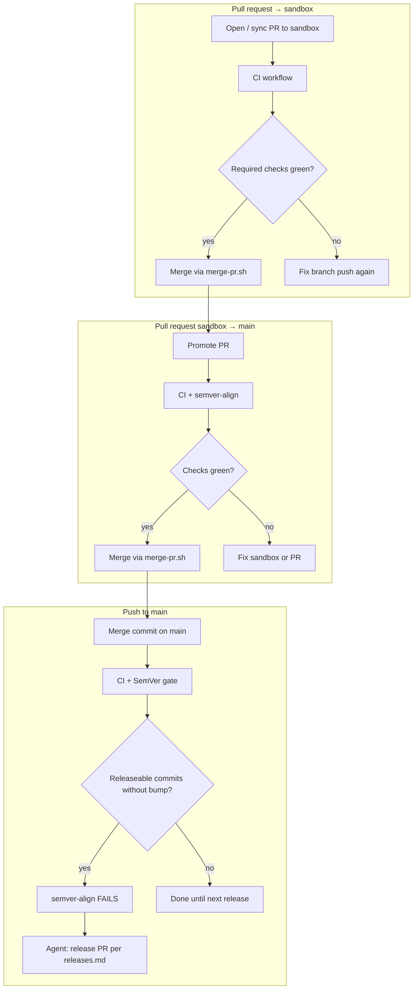

# Delivery automation map

What runs automatically on each GitHub event — **no ad-hoc “owner decides when”**. Agents and CI follow this table; humans intervene on red gates.

Detailed prose lives in [`git-workflow.md`](./git-workflow.md), [`releases.md`](./releases.md), and [`delivery-observability.md`](./delivery-observability.md). This page is the **event → next action** index.

## Event → workflow → next action

| Git event                 | Workflows / jobs                                                           | SemVer gate           | Agent / human next step                                           |
| ------------------------- | -------------------------------------------------------------------------- | --------------------- | ----------------------------------------------------------------- |
| **PR** → `sandbox`        | `CI` (`commitlint`, **`issue-link`**, `quality`, `security`, `codeql`)     | No                    | Merge when required checks green — `bash scripts/merge-pr.sh <n>` |
| **PR** → `main` (promote) | Same + **`semver-align`**                                                  | Yes (on PR to `main`) | Body prefers `Closes #N`; merge only via `merge-pr.sh`            |
| **Push** → `sandbox`      | `CI` (`merge-tip`, `quality`, …) + `Delivery observability` on CI complete | No                    | Integrate; open promote PR when ready                             |
| **Push** → `main`         | Same + **`semver-align`** + SonarCloud                                     | **Yes**               | If fail → open release PR ([`releases.md`](./releases.md))        |
| Dependabot PR → `sandbox` | Same as PR → `sandbox` (`issue-link` skipped for Dependabot)               | No                    | Review + merge to `sandbox` → promote                             |

AIOS uses **`sandbox` + `main`** ([ADR-0002](../adr/0002-git-branching-strategy.md)). Promotion is **two PRs**, not one.

## Issue-link (work PRs → sandbox)

- CI job: `issue-link` → `scripts/check-pr-issue-link.sh` (#435)
- Local parity **before** push / `gh pr create`: `bash scripts/check-pr-delivery-gate.sh`
- Closing keywords (`Closes` / `Fixes` / `Resolves`) only auto-close on PRs targeting **`main`** ([GitHub docs](https://docs.github.com/en/issues/tracking-your-work-with-issues/using-issues/linking-a-pull-request-to-an-issue))

## SemVer gate (anti-drift)

Script: `scripts/check-semver-alignment.sh` (CI job `semver-align`)

- Runs on **push to `main`** and on **PRs targeting `main`**
- Fails when `main` has **releaseable** commits (`feat` / `fix` / …) after the last tag without a version bump + CHANGELOG section
- Non-releaseable alone: `chore`, `docs`, `ci`, `test`, `style`, `build`, `merge`, Dependabot `chore(deps):`

## Release cadence (when to tag)

**Trigger:** `[Unreleased]` ready after a feature slice is on `main`, or `semver-align` red.

**Steps** (agent plans; owner authorizes commit/tag):

1. Bump root `package.json` (and workspace packages if this release publishes them) to `X.Y.Z`
2. Move `[Unreleased]` → `## [X.Y.Z] - YYYY-MM-DD` in `CHANGELOG.md`
3. PR → `sandbox` then promote → `main` (or release commits already on the promote path)
4. On `main` HEAD: annotated tag `vX.Y.Z` and push the tag
5. Optional: ingest delivery metrics — `node scripts/record-delivery-ci.mjs --pr <N>` ([ADR-0028](../adr/0028-delivery-ci-observability.md))

There is **no** tag-driven `release.yml` in this repo today — tags and GitHub Release objects are operator-owned per [`releases.md`](./releases.md).

## CI monitoring (agents)

Prefer **async** babysit ([ADR-0028](../adr/0028-delivery-ci-observability.md), [`task-kickoff.md`](./task-kickoff.md)): open/update PR → end turn or continue other work → ingest when checks settle.

If the owner asks for a blocking watch: `gh pr checks --watch`. **Never merge on red `issue-link`.** Distinguishes `quality` / `security` / Sonar / CodeQL failures.

## Related

- [`git-workflow.md`](./git-workflow.md)
- [`task-kickoff.md`](./task-kickoff.md)
- [`local-runtime-authorization.md`](./local-runtime-authorization.md)
- [`releases.md`](./releases.md)
- [`delivery-observability.md`](./delivery-observability.md)
- [`scripts/merge-pr.sh`](../../scripts/merge-pr.sh)
