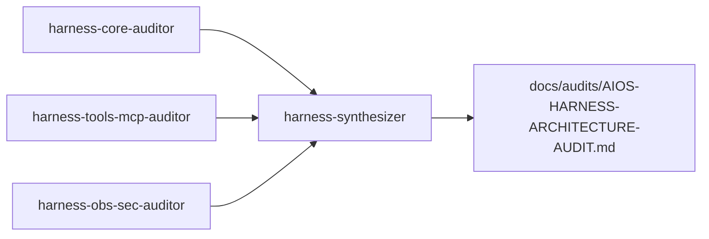

# GitHub Copilot custom agents

Specialized agents under [`.github/agents/`](../../.github/agents/) for least-privilege assistance.

Routing: [`AGENTS.md`](../../AGENTS.md) · Reference: [Creating custom agents](https://docs.github.com/en/copilot/how-tos/copilot-on-github/customize-copilot/customize-cloud-agent/create-custom-agents).

These are **IDE/GitHub surfaces**, not the product UX. Product agent plugins live under `engines/agent-*` and are invoked only via AIOS (Intent → Workflow) — policy `agents-as-plugins`.

## General agents

| Agent                   | File                           | Tools              | Purpose                                             |
| ----------------------- | ------------------------------ | ------------------ | --------------------------------------------------- |
| **task-planner**        | `task-planner.agent.md`        | read, search       | Plan slices — no implementation                     |
| **code-reviewer**       | `code-reviewer.agent.md`       | read, search       | PR/diff review (policies, ADR, Git flow)            |
| **docs-writer**         | `docs-writer.agent.md`         | read, search, edit | Docs aligned to code                                |
| **appsec-reviewer**     | `appsec-reviewer.agent.md`     | read, search       | PR AppSec posture (secrets, MCP, SAFE_WRITE, paths) |
| **release-coordinator** | `release-coordinator.agent.md` | read, search       | Release checklist (SemVer, CHANGELOG, promote, tag) |

## Harness architecture audit (parallel workers)

Long contract lives in **VaultSpring PKB** (`prompt.delivery.aios-harness-architecture-audit`) — not duplicated in agent bodies.

| Agent                         | Scope                                                    | Tools              |
| ----------------------------- | -------------------------------------------------------- | ------------------ |
| **harness-core-auditor**      | Pipeline, policy, context, agent runtime                 | read, search       |
| **harness-tools-mcp-auditor** | MCP, model, execution, eval, replay                      | read, search       |
| **harness-obs-sec-auditor**   | Observability, security, HITL, budget                    | read, search       |
| **harness-synthesizer**       | Merge → `docs/audits/AIOS-HARNESS-ARCHITECTURE-AUDIT.md` | read, search, edit |

Run workers **in parallel** when domains are independent; synthesizer runs last.

## Design rules

1. **Unique purpose** — one agent, one domain
2. **Least privilege** — reviewers/planners/auditors read-only; docs-writer may edit docs; synthesizer may edit the audit doc only
3. **PKB for long prompts** — link `docs/prompts/` or VaultSpring PKB for cross-repo contracts; do not embed huge bodies
4. **Foundation wins** — `docs/FOUNDATION.md` + ADRs over agent prose
5. **No IDE co-author trailers** in commits
6. **Do not** replace `engines/agent-appsec` (or other plugins) — Copilot agents review/audit; product agents run inside AIOS

## Adding an agent

1. Create `.github/agents/<name>.agent.md`
2. YAML: `name`, `description`, `tools`; optional `handoffs`
3. Update this catalog in the same PR
4. PR → `sandbox` with `Refs #N`

## Related

- [`delivery-automation.md`](./delivery-automation.md)
- [`local-runtime-authorization.md`](./local-runtime-authorization.md)
- [`releases.md`](./releases.md)
- [`SECURITY.md`](../../SECURITY.md)
- [`docs/audits/AIOS-HARNESS-ARCHITECTURE-AUDIT.md`](../audits/AIOS-HARNESS-ARCHITECTURE-AUDIT.md)
